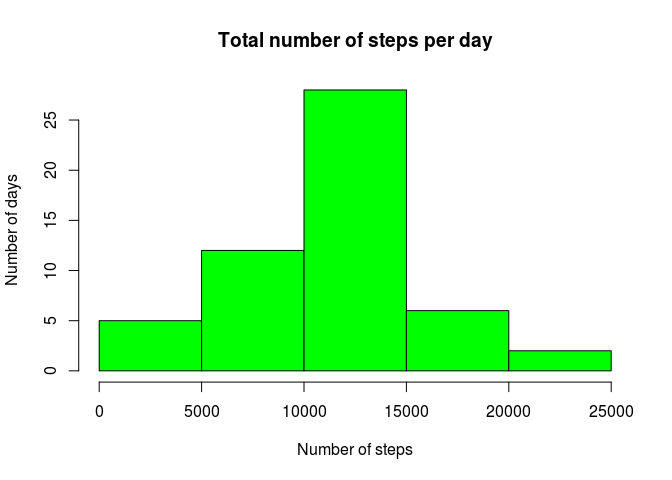

Loading and preprocessing the data
----------------------------------

``` r
data <- read.csv("activity.csv")
```

What is mean total number of steps taken per day?
-------------------------------------------------

Note: the missing values in the dataset are ignored.

1.  Calculate the total number of steps taken per day

``` r
data_by_day <- aggregate(steps ~ date, data, sum)
```

1.  Make a histogram of the total number of steps taken each day

``` r
hist(data_by_day$steps, main = paste("Total number of steps per day"), xlab="Number of steps", ylab="Number of days", col="green")
```



1.  Calculate and report the mean and median of the total number of steps taken per day

``` r
steps_mean <- round(mean(data_by_day$steps), 2)
steps_median <- median(data_by_day$steps)
```

The mean total number of steps per day is 10766.19, and median is 10765.

What is the average daily activity pattern?
-------------------------------------------

1.  Make a time series plot (i.e. type="l") of the 5-minute interval (x-axis) and the average number of steps taken, averaged across all days (y-axis)

``` r
data_by_interval <- aggregate(steps ~ interval, data, mean)
plot(data_by_interval$interval, data_by_interval$steps, type="l", xlab="Interval", ylab="Average number of steps", main="Average number of steps per day and per interval")
```


1.  Which 5-minute interval, on average across all the days in the dataset, contains the maximum number of steps?

``` r
maxstep_interval <- data_by_interval$interval[which.max(data_by_interval$steps)]
```

The interval containing the maximum number of steps on average is 835.

Imputing missing values
-----------------------

1.  Calculate and report the total number of missing values in the dataset (i.e. the total number of rows with NAs)

``` r
total_na <- sum(is.na(data))
total_na
```

    ## [1] 2304

1.  Create a new dataset by filling in missing values in the current dataset with means for corresponding 5-minute intervals.

``` r
filled_data <- data.frame(data)
missing_values = which(is.na(filled_data$steps))
filled_data[missing_values, "steps"] <- sapply(filled_data[missing_values, "interval"], function(x){
    x <- data_by_interval$steps[data_by_interval$interval==x]
})
```

1.  Make a histogram of the total number of steps taken each day for new filled in data

``` r
filled_data_by_day <- aggregate(steps ~ date, filled_data, sum)
hist(filled_data_by_day$steps, main = paste("Total number of steps per day in filled in data"), xlab="Number of steps", ylab="Number of days", col="blue")
```


1.  Calculate and report the mean and median of the total number of steps taken per day for filled in data

``` r
steps_mean <- round(mean(filled_data_by_day$steps), 2)
steps_median <- round(median(filled_data_by_day$steps), 2)
```

In filled data the mean total number of steps per day is 10766.19, and median is 10766.19. With the addressed filling in strategy, the median value is now equal to mean value.

Are there differences in activity patterns between weekdays and weekends?
-------------------------------------------------------------------------

1.  Create a new factor variable in the dataset with two levels – “weekday” and “weekend” indicating whether a given date is a weekday or weekend day.

``` r
filled_data$day <- ifelse(weekdays(as.Date(filled_data$date)) %in% c("Saterday", "Sunday"), 1, 0)
filled_data$day <- factor(filled_data$day, labels = c("weekday", "weekend"))
```

1.  Make a panel plot containing a time series plot (i.e. type="l") of the 5-minute interval (x-axis) and the average number of steps taken, averaged across all weekday days or weekend days (y-axis). See the README file in the GitHub repository to see an example of what this plot should look like using simulated data.

``` r
data_interval_days <- aggregate(steps ~ interval + day, filled_data, mean)
xyplot(data_interval_days$steps ~ data_interval_days$interval|data_interval_days$day, type="l", main="Average number of steps per day type and per interval", xlab="Interval", ylab="Average number of steps", layout=c(1,2))
```


